# Adjudicating Parity (Migration track, phase M-B - spec)

## Overview

A `.episteme/parity-map.md` is the migration spec: for every capability the
legacy system has, it records ONE explicit decision - `retire`,
`retain-on-legacy`, `migrate-as-is`, `migrate-and-fix`, or `repurchase` - with
the evidence and rationale behind it; it adjudicates every captured quirk as
**preserve** or **fix** with the human decision recorded; it lays out an ordered
plan of value-stream slices, each with feasibility notes drawn from the
inventory's coupling facts; and it states explicitly what is out of scope.

In the Migration track this skill **replaces `writing-a-prd`**. A greenfield PRD
specifies a vision that does not exist yet; a migration specifies a system that
already exists - and "specify everything it does, then rebuild it" is the
documented trap. Teams that chase full feature parity drown in as-is analysis
and end in big-bang failure. The high-value moves are usually `retire` and
cutting scope: **cutting scope is cheaper than rewriting**. So this skill's
whole job is to put parity on trial, capability by capability, and to make
every survival of legacy behavior an explicit, evidenced, human-owned decision.

**Core principle:** Parity is the null hypothesis you argue AGAINST per
capability. Nothing migrates because it exists; it migrates because someone
decided it should, said why, and recorded who decided.

**Violating the letter of these rules is violating the spirit of these rules.**

This is the Migration track's spec phase (M-B). It reads
`.episteme/behavior-inventory.md` (produced by the capture phase, M-A) plus
`.episteme/ledger.jsonl`, and hands off to `deciding-architecture` (with
brownfield notes) and then `sharding-into-stories` (slices -> stories).
Lineage: the decision vocabulary and the slice-and-strangle doctrine adapt
Patterns of Legacy Displacement (Fowler et al.) and the industry
retire/retain/repurchase taxonomy - credited, not copied. What Episteme adds is
the **epistemic through-line**: every decision carries cited evidence and lands
in the curated ledger, every quirk adjudication is a named human checkpoint, and
`assumed` captured behavior is flagged for verification before any slice
contract is built on it.

## When to Use

**Use when:**
- A Migration-track effort has a `.episteme/behavior-inventory.md` and needs the
  decision layer before architecture and stories (e.g. a VB6 invoicing module
  moving to a NestJS service, a stored-procedure billing engine moving to a
  typed domain layer).
- An existing parity map must be re-adjudicated: new coupling facts surfaced, a
  capture spike contradicted the inventory, or a retained capability's reopen
  condition fired.

**When NOT to use:**
- Greenfield work - use `writing-a-prd`. There is no captured behavior to
  adjudicate.
- The behavior inventory does not exist yet or is skeletal - go back to the
  capture phase (M-A). Adjudicating from memory or from reading the legacy code
  alone produces decisions about a system nobody observed.
- A small in-place refactor of a live codebase that is not being displaced -
  that is the normal loop with a contract, not a migration.

**Symptoms you are about to need it:** someone says "just rebuild what it does
today", a migration plan has no list of what will NOT be migrated, or the team
is writing new-system stories while nobody has decided which legacy bugs must
be reproduced.

## The Iron Law

```
PARITY IS THE NULL HYPOTHESIS - EVERY CAPABILITY CARRIES AN EXPLICIT
DECISION AND EVERY QUIRK AN EXPLICIT PRESERVE-OR-FIX ADJUDICATION;
NOTHING MIGRATES BY DEFAULT.
```

A capability without a decision line has been migrated by inertia - the exact
failure mode this phase exists to prevent. A quirk without an adjudication will
either be silently fossilized into the new system (blind behavioral oracles
preserve defects) or silently "fixed" (breaking the downstream consumer that
reconciled against the defect). Both are decided here, on the record.

**No exceptions:**
- No capability ships in the map without exactly one of the five decisions,
  plus evidence and rationale.
- No quirk ends the phase without preserve-or-fix, decided by a named human.
  The agent proposes; a human decides; the record says who and why.
- No slice contract gets built on a behavior whose authority is still
  `assumed` - flag it, capture it first.

## The decision vocabulary (the only five words)

Every capability gets exactly one. "Migrate" without a flavor, or "as-is but
cleaned up", is not a decision - it is the trap with better posture.

| Decision | Means | Demands |
|---|---|---|
| `retire` | The capability does not exist in the new system; its legacy use ends. | Evidence of disuse (usage logs, call counts, owner confirmation) - `verified` where possible; an owner sign-off when any doubt remains. |
| `retain-on-legacy` | Stays on the legacy system behind the seam; not migrated in this program. | A reason it is not worth migrating yet AND a **reopen condition** (what change would put it back on the table), both recorded. |
| `migrate-as-is` | Reproduce the captured behavior in the new system, INCLUDING its adjudicated-preserve quirks. | A captured corpus backing the behavior; every quirk of the capability adjudicated. |
| `migrate-and-fix` | Reproduce the capability, but one or more captured behaviors are adjudicated as BUGS and fixed in the new system. | Each fix is a human-adjudicated quirk (`fix`), with the intended new behavior stated testably. |
| `repurchase` | Replace with an off-the-shelf product/service; only data and integration migrate. | The product named; a gap analysis against the captured behaviors; the integration surface noted. |

`retire` and `retain-on-legacy` are not failure modes - they are usually the
highest-value rows in the map. A map where everything is `migrate-*` on a
system more than a few years old means nobody actually argued against parity.

## The epistemic through-line (the whole point)

Three threads run through every section. Drop one and this is just an as-is
inventory with verbs attached.

### 1. Parity is argued against, per capability

For each capability, you do not ask "how do we rebuild this?" - you ask "why
should this exist in the new system at all?". Run the parity-challenge gate
(below) before reaching for `migrate-*`. Evidence of use is a finding; absence
of evidence of use is a flag, not a license to assume value. Cite ledger
findings (`verified` usage data outranks "the team thinks it's used").

### 2. Quirk adjudication is a human checkpoint

Captured behavior includes bugs. A legacy invoicing module that rounds tax per
line item and drifts $0.02 per invoice is a defect - unless the ERP export has
reconciled against those exact totals for nine years, in which case "fixing" it
breaks production. Only a human with domain authority can adjudicate that. The
protocol:

1. **The agent proposes** per quirk: `preserve` or `fix`, with evidence both
   ways - who consumes the output, what reconciles against it, what the
   "correct" behavior would be and what it would break.
2. **A human decides.** Name/role + date recorded in the Quirk Adjudication
   Log. The agent NEVER finalizes an adjudication alone, however obvious.
3. **The decision is curated**: a ledger `decision` entry whose `source` cites
   the human decision (e.g. `"human decision - finance lead, 2026-06-02,
   parity-map Q-6"`). The choice itself, once made, is a fact - cite the
   recorded sign-off in `evidence_for`. Any factual claim the rationale rests
   on that is not oracle-backed (e.g. "the ERP depends on this rounding") stays
   a separate `assumption` entry until verified.
4. **`preserve`** means the quirk enters the slice's equivalence contract: the
   new system must reproduce it, oracle drawn from the captured corpus.
   **`fix`** means the slice contract is "equivalent to legacy EXCEPT the named
   fix", and the fix gets its own oracle-backed acceptance criterion. A `fix`
   record MUST mint a `par-NNNN` adjudicated override in the parity map's
   Adjudicated Overrides section, stating the new expected behavior testably -
   that override is what downstream replay (`verifying-equivalence`) resolves
   expected outputs against (adjudicated-override-first, legacy-capture
   otherwise).
5. **Undecidable now** (human unavailable, evidence missing)? The quirk stays
   `open`, listed as a blocker - its capability cannot enter a slice contract
   until adjudicated.

### 3. Authority survives into the slice plan

The inventory tags each captured behavior with authority: `verified` (observed
on the running system, ideally with a captured input/output corpus) or
`assumed` (read from the code, inferred from docs, or team folklore). That tag
must survive into your plan: **any behavior still `assumed` that a slice
depends on gets a `Capture-first:` flag**, and a capture spike is ordered
before that slice - run the legacy against recorded inputs, capture the
outputs, let the curator flip the entry to `verified`. A slice contract whose
criterion is "output-equivalent to legacy on the captured corpus" is
meaningless if the corpus is a guess; you would be verifying the new system
against a hypothesis.

## The Process

```dot
digraph parity_flow {
  rankdir=LR;
  inv     [label="Read inventory\n+ ledger", shape=box];
  roster  [label="Capability roster\n(ids verbatim)", shape=box];
  argue   [label="Per capability:\nparity-challenge gate", shape=box, style=filled, fillcolor="#ffcccc"];
  decide  [label="One of the five\n+ evidence?", shape=diamond];
  quirks  [label="Quirk adjudication\n(human decides)", shape=box, style=filled, fillcolor="#ffe0b3"];
  slices  [label="Slice plan from\ncoupling facts", shape=box];
  flags   [label="Flag assumed deps\n-> capture spikes", shape=box, style=filled, fillcolor="#cce5ff"];
  oos     [label="Out of scope\n(explicit)", shape=box];
  curate  [label="invoke\ncurating-the-ledger", shape=box];
  done    [label="closure verdict\n-> deciding-architecture", shape=box];
  inv -> roster -> argue -> decide;
  decide -> quirks [label="yes"];
  decide -> argue  [label="no\n(get evidence)"];
  quirks -> slices -> flags -> oos -> curate -> done;
}
```



1. **Read the sources of truth.** `.episteme/behavior-inventory.md` end to end,
   and `.episteme/ledger.jsonl` (prior findings, usage data, coupling facts and
   their authority tags). This is the folded fact-gathering step - decisions
   cite these, never memory.
2. **Build the capability roster.** Transcribe every capability from the
   inventory with its ids verbatim - capabilities are keyed `CAP-NN` exactly as
   the inventory's capability table has them, quirks are keyed `Q-NN` exactly as
   the inventory's Quirk register has them - no renumbering, none silently
   dropped. If the inventory is vague on something load-bearing, send it back
   to the capture phase; do not paper over it.
3. **Run the parity-challenge gate per capability** (below) and record ONE of
   the five decisions, with evidence refs (inventory ids, ledger ids, usage
   data) and a rationale a reviewer can audit.
4. **Adjudicate every quirk** of every `migrate-*` capability via the protocol
   in thread 2. Fill the Quirk Adjudication Log: proposal, human decision, who,
   when, why - and mint a `par-NNNN` adjudicated override for every `fix`
   decision. Quirks of retired/retained capabilities are marked moot (no new
   system behavior to adjudicate).
5. **Design the slice plan.** Slice by **value stream** (an end-to-end flow a
   user or downstream system cares about: "quote-to-invoice", "monthly
   statement run"), never by technical layer. Order the slices. For each, write
   the feasibility notes from the inventory's coupling facts (below).
6. **Flag `assumed` dependencies.** For each slice, list the behaviors it
   depends on whose authority is still `assumed`; add `Capture-first:` flags
   and order a capture spike before the slice.
7. **Write the explicit Out of Scope**: retired capabilities (with evidence),
   retained-on-legacy (with reopen conditions), and any dropped scope.
8. **Curate everything.** Every capability decision, every quirk adjudication,
   every retain-reopen condition becomes a ledger `decision` entry (handed to
   `curating-the-ledger` - you never write the ledger yourself). Human
   adjudications cite "human decision" as source. Confirm `ledger-check` is
   clean.
9. **Write the closure verdict** (`Adjudication: N capabilities, all decided; M
   quirks, all adjudicated` or the open list). When the closure verdict has zero
   gaps, set `status: adjudicated` in the parity-map frontmatter; otherwise it
   stays `draft` with the gaps listed. Hand off to `deciding-architecture`.

### The parity-challenge gate

**MANDATORY for every capability.** Answer, with evidence, before any
`migrate-*` decision:

1. **Who used this in the last 12 months, and what evidence says so?** Usage
   logs, audit trails, call counts - a `verified` finding. "The team thinks
   it's used" is `assumed`; say so. No evidence of use -> propose `retire` and
   get the owner's sign-off.
2. **What breaks if it does not exist in the new system?** If the honest answer
   is "nothing we can name", that is `retire` talking.
3. **Does an off-the-shelf product cover it?** If yes, `repurchase` and do the
   gap analysis instead of rebuilding.
4. **Would retaining it on legacy behind the seam cost less than migrating it
   now?** Low value + low change rate -> `retain-on-legacy` with a reopen
   condition.
5. Only when 1-4 fail to remove it: `migrate-as-is` or `migrate-and-fix` -
   and now every one of its quirks must be adjudicated.

### The slice feasibility check

A slice is only as feasible as its coupling allows, and the inventory's
coupling facts are the evidence: shared database tables and who writes them,
COM/interop dependencies, cross-form or cross-module global state, batch-job
timing and ordering, implicit contracts with downstream exports. For each
slice record:

- **Capabilities in the slice** (only `migrate-*` ones produce build work;
  note adjacent retire/retain/repurchase capabilities the seam must respect).
- **Cutover mechanism** - how traffic/users/data move to the new system for
  this slice (routing rule, feature flag, dual-run with comparison).
- **Reversibility** - how this slice rolls back if the cutover fails. A slice
  with no rollback story is a small big-bang; redesign it.
- **Feasibility notes** - the specific coupling facts that constrain the seam,
  cited by inventory/ledger id (e.g. "CAP-31: invoice and inventory modules
  write the same `STOCK` table; this slice needs a sync strategy or both
  capabilities move together"). These same facts feed
  `synthesizing-the-policy`'s reachability audit downstream, so cite them
  precisely rather than summarizing.
- **Capture-first flags** - the `assumed` behaviors this slice depends on, and
  the capture spike that precedes it.

Never one all-at-once cutover. Each slice independently cut over, independently
reversible - that is the strangler-fig shape, and the coupling facts are what
make it honest instead of aspirational.

## What goes in `.episteme/parity-map.md`

Use `templates/parity-map.md`. The spine:

- **Frontmatter** - `inventory` (source artifact), `created`, `updated`,
  `status: draft`.
- **§1 Decision Summary** - one row per capability: id, name, decision, slice,
  quirks, ledger entry. The at-a-glance audit surface.
- **§2 Capability Decisions** - per capability: the decision, evidence refs,
  rationale, quirk adjudications, slice assignment.
- **§3 Quirk Adjudication Log** - one row per quirk (`Q-NN` verbatim from the
  inventory's Quirk register): captured behavior, agent proposal, human decision
  (preserve/fix/open), decided by, date, rationale, ledger entry.
- **§4 Adjudicated Overrides (par-NNNN)** - one row per `fix`-adjudicated quirk:
  the quirk it implements, corpus scope, the testable new expected behavior, who
  decided, ledger entry. The only legitimate divergences from the captured
  legacy outputs.
- **§5 Slice Plan** - ordered value-stream slices, each with capabilities,
  cutover, reversibility, feasibility notes (coupling facts cited),
  capture-first flags.
- **§6 Capture-First Index** - every `assumed` behavior a slice depends on ->
  its capture spike -> the slice it blocks.
- **§7 Out of Scope** - retired (evidence), retained-on-legacy (reopen
  conditions), dropped scope.
- **§8 Open Questions & Blockers** - including every `open` quirk.
- **Closure verdict** - the explicit, checkable line.

## Good vs Bad

<Good>
```markdown
#### CAP-4: Invoice tax rounding
Decision: migrate-as-is
Evidence: CAP-4 capture (verified - corpus of 412 invoices, .episteme/captures/CAP-4/), led-0023 (verified -
  monthly ERP export reconciles against legacy invoice totals)
Rationale: legacy rounds tax per line item then sums; the ERP export has
  reconciled against these totals since 2017, so the new NestJS service must
  reproduce the captured outputs exactly, including Q-6.
Quirks:
  - Q-6 (per-line rounding drift, up to $0.02/invoice vs whole-invoice rounding)
    -> PRESERVE - human decision: finance lead, 2026-06-02. "ERP reconciliation
    depends on the legacy totals; changing rounding mid-year breaks the audit."
    Ledger: led-0031.
Slice: S-2 (quote-to-invoice)
```
One of the five decisions; evidence cited by id and authority; the quirk is
adjudicated by a named human with a reason; the ledger entry exists; the slice
is assigned.
</Good>

<Bad>
```markdown
#### CAP-4: Tax stuff
Decision: migrate (we'll keep it the same but also clean it up)
Rationale: it's important.
```
"Migrate" is not one of the five words. "Same but cleaned up" merges
migrate-as-is with migrate-and-fix so nobody decided which behaviors survive -
every silent "cleanup" is an unadjudicated fix waiting to break a downstream
consumer. "It's important" cites no evidence, no usage, no human.
</Bad>

## Common Mistakes

| Mistake | Fix |
|---|---|
| Decision is "migrate" with no flavor | Pick one of the five. As-is and and-fix are different contracts downstream. |
| "Migrate-as-is, but improved" | That is migrate-and-fix with hidden fixes. Name each improvement as a `fix`-adjudicated quirk. |
| A quirk fixed silently because it is "obviously a bug" | A downstream system may reconcile against the bug. Propose; the human adjudicates; record who and why. |
| A quirk preserved silently "to be safe" | Blanket preservation fossilizes defects and bloats the equivalence corpus. Adjudicate each one. |
| Slices drawn by technical layer ("the DB slice", "the API slice") | Slice by value stream - an end-to-end flow that can cut over and roll back alone. |
| Feasibility notes that ignore a shared-DB coupling fact | Cite the coupling facts by id; shared writes are what make a seam expensive or impossible. |
| A slice contract planned on an `assumed` behavior | Capture-first flag + a capture spike before the slice. Equivalence to a guess is not equivalence. |
| Empty or missing Out of Scope | The out-of-scope list IS the value of this phase. If nothing is out, parity won by default. |
| Decisions live only in the document | Every decision and adjudication goes to `curating-the-ledger`; the document is the surface, the ledger is the memory. |

## Red Flags - STOP

- A capability in the inventory with no row in the Decision Summary.
- A decision outside the five-word vocabulary, or a hybrid ("as-is plus
  cleanup").
- A quirk with no preserve-or-fix line, or one adjudicated by the agent alone
  (no human name/role and date).
- Zero `retire` and zero `retain-on-legacy` rows on a system more than a few
  years old - you transcribed parity instead of arguing against it.
- A slice with no cutover mechanism or no reversibility note.
- A slice whose feasibility notes cite no coupling facts despite the inventory
  recording shared state.
- An `assumed` behavior feeding a slice with no `Capture-first:` flag and no
  capture spike ordered before it.
- An empty Out of Scope section.
- Decisions claimed as curated without a clean `ledger-check` run.

**All of these mean: stop, argue the capability, adjudicate the quirk with the
human, fix the slice, and only then hand off.**

## Rationalization Prevention

| Excuse | Reality |
|---|---|
| "Just migrate everything 1:1, it's safer" | Full parity is the documented big-bang failure mode. Safety comes from explicit decisions and reversible slices, not from copying everything. |
| "Defining what it does today is the diligent first step" | As-is exhaustiveness is the trap itself - it burns the budget before any decision is made. Decide per capability; capture deeply only what migrates. |
| "This quirk is obviously a bug, just fix it" | Obvious to you; the downstream export may reconcile against it. You propose, a human adjudicates, the record says who and why. |
| "Preserve every quirk, equivalence will catch everything" | Blind behavioral oracles fossilize defects. Every preserved quirk is a decision someone must own, not a default. |
| "We'll decide retire/retain during implementation" | By then parity has already won - the stories exist, the code is half-written. The decision layer is THIS phase. |
| "The inventory says assumed, but it's almost certainly right" | "Almost certainly" is `assumed`. A slice contract verifying against an uncaptured behavior verifies a guess. Capture first. |
| "One coordinated cutover weekend is simpler than slices" | That is a big-bang with a calendar invite. Each slice cuts over and rolls back independently or the plan is not a strangler fig. |
| "Recording who decided is bureaucracy" | The adjudication log is the audit trail that survives the team. Six months in, "why does the new system reproduce this bug?" must have an answer with a name on it. |

## Verification Checklist

Before handing off to `deciding-architecture`:

- [ ] Read `.episteme/behavior-inventory.md` and `.episteme/ledger.jsonl` this
      session (not from memory)
- [ ] Every inventory capability appears in the roster, ids verbatim, none
      dropped or renumbered
- [ ] Every capability carries exactly one of the five decisions, with evidence
      refs and an auditable rationale
- [ ] The parity-challenge gate was answered for every `migrate-*` capability
      (usage evidence, breakage, repurchase, retain)
- [ ] **Every quirk of every `migrate-*` capability is adjudicated preserve or
      fix, by a named human, with date and rationale** - none agent-only;
      `open` quirks listed as blockers
- [ ] Every `fix`-adjudicated quirk has a `par-NNNN` row in Adjudicated
      Overrides with a testable new expected behavior
- [ ] Slice plan: ordered value-stream slices; each has a cutover mechanism, a
      reversibility note, and feasibility notes citing coupling facts by id
- [ ] Every slice depending on an `assumed` behavior carries a `Capture-first:`
      flag with a capture spike ordered before it
- [ ] Out of Scope is explicit: retired (with evidence), retained-on-legacy
      (with reopen conditions), dropped scope
- [ ] **Every decision and adjudication handed to `curating-the-ledger`;
      `ledger-check` is clean** (human adjudications cite "human decision" as
      source)
- [ ] The closure verdict is written explicitly (`Adjudication: N capabilities,
      all decided; M quirks, all adjudicated` or the gap list)
- [ ] Frontmatter `status: adjudicated` (closure verdict has zero gaps) - or
      `status: draft` with the gaps listed

Can't check all boxes? The map is not ready. Don't hand off.

## Handoff

- **`deciding-architecture`** reads the parity map with brownfield eyes: the
  legacy system stays a live neighbor for every `retain-on-legacy` capability,
  so the architecture must model the seam (anti-corruption layer per slice, a
  sync strategy for every shared-state coupling fact named in the feasibility
  notes, the dual-run/comparison plumbing the cutovers need).
- **`sharding-into-stories`** turns slices into epics and stories: each slice
  becomes a story group in cutover order, and the capture spikes ordered here
  become spike stories before their dependents.
- **Downstream contracts:** for a `migrate-as-is` capability, each slice's
  contract criteria become **"output-equivalent to legacy on the captured
  corpus"**, with oracles captured from legacy outputs; the sibling skill
  `verifying-equivalence` produces those equivalence verdicts. For
  `migrate-and-fix`, the contract is equivalence on everything EXCEPT each
  `fix`-adjudicated quirk, which gets its own oracle-backed acceptance
  criterion stating the new behavior (the `par-NNNN` override).

Re-run this skill when a capture spike contradicts the inventory, a new
coupling fact surfaces, an `open` quirk gets adjudicated, or a
`retain-on-legacy` reopen condition fires - re-argue the affected capabilities
and re-run the closure check. Amend decisions via the curator (`supersedes`),
never by silently editing the map's history.

## The Bottom Line

A migration spec that lists what the legacy system does is an inventory; a
migration spec that decides what survives, what dies, what gets fixed and who
said so is a parity map. Argue against parity per capability, put a human's
name on every quirk, slice by value stream with the coupling facts on the
table, capture before you contract - then hand the map to architecture. Nothing
migrates by default.
