# Excavating Behavior (Migration track, phase M-A - excavation)

## Overview

This is the migration counterpart of `writing-a-brief` - with one inversion. In a
greenfield brief, the spec lives as prose in someone's head and you write it down.
In a migration there is no prose to capture: **the spec already exists, encoded in
the running legacy system, and nowhere else**. Decades of patches, workarounds and
undocumented business rules ARE the requirements. Your job is not to write a brief;
it is to **exhume one** - and to be honest, line by line, about how you know each
piece.

The output is the **behavior inventory**: a capability map of what the legacy
system actually does, where every single row is tagged with how we know it -
**captured** from the running system (a fact) or **inferred** by reading code
(a hypothesis). The state of the art in legacy modernization converged on
behavior-first: do not translate code; capture what the running system does and
make that the spec. What the literature lacks is a first-class artifact for the
captured-vs-inferred distinction. The Episteme ledger is exactly that artifact.

**Core principle:** The running legacy system is the only authority on its own
behavior. Behavior you captured from it is `verified`. Behavior you inferred by
reading its code - whether you are a human or an LLM - is `assumed`. The inventory
never lets the two blur.

**Violating the letter of these rules is violating the spirit of these rules.**

## The Iron Law

```
NO BEHAVIOR ENTERS THE INVENTORY WITHOUT AN AUTHORITY TAG.

  captured from the RUNNING system          -> verified
  read from the code (human or LLM reading) -> assumed

There is no third tag, and no row without one.
```

And its corollary, the **direction of the oracle**:

```
ORACLES ARE CAPTURED FROM THE LEGACY SYSTEM, BLIND TO THE NEW CODE.
NEVER generate an expected output from the new implementation.
```

A "test" whose expected value came from the new code validates the implementation
against itself - it proves the rewrite agrees with the rewrite. It will pass while
the migrated system quietly drops a rounding rule that finance depended on for
fifteen years. Golden masters are recorded FROM the legacy system, before and
independent of any new code. This is the same blind separation the contract loop
uses (oracle-author never sees the implementation), applied to migration.

## When to Use

**Use when:**
- A legacy system is being rewritten or replatformed (e.g. a VB6 order-entry app
  moving to a Next.js/NestJS stack) and nobody can produce a spec of its current
  behavior that they would bet the migration on.
- You are on the **Migration track** and about to plan the replacement - this is
  phase M-A, before any contract or new code.
- A "lift and shift" or LLM code translation is being proposed and you need the
  ground truth to judge parity against.

**Symptoms you skipped this:**
- Parity claims with no oracle ("the new version does the same thing - we read the
  old code carefully").
- Test suites for the new system whose expected outputs were generated by the new
  system.
- A migration plan scoped by module/file count instead of by capability.
- Surprise behavior discovered in production after cutover ("the old one rounded
  down", "the old one tolerated NULL there").

**When NOT to use:** greenfield work (use `writing-a-brief`); a system that already
has a trustworthy behavioral test suite (that suite IS the inventory - go verify it
still passes and move on); a pure infrastructure move with zero code change.

## What you produce

- `.episteme/behavior-inventory.md` - from `templates/behavior-inventory.md`. The
  human-browsable capability map. **Every row cites its ledger id and its
  authority.** A row without both does not exist.
- Capture artifacts under `.episteme/captures/<CAP-id>/` - recorded inputs,
  golden-master outputs, DB before/after snapshots, replay scripts. These are the
  oracles; the ledger's `oracle_ref` points at them.
- Typed ledger entries in `.episteme/ledger.jsonl` - **via `curating-the-ledger`,
  never written directly by this skill.** The curator owns the ledger.

Read any existing `.episteme/ledger.jsonl` first - it is prior memory, and the
inventory must not contradict a `verified` entry without superseding it.

## The Process

```dot
digraph excavation_flow {
  rankdir=LR;
  intel   [label="1. Code intelligence\n(static, cheap)", shape=box];
  capture [label="2. Capture from the\nRUNNING system", shape=box, style=filled, fillcolor="#ccffcc"];
  infer   [label="3. Code-reading inference\n(for what capture missed)", shape=box, style=filled, fillcolor="#fff0cc"];
  split   [label="Authority?", shape=diamond];
  curate  [label="4. Hand entries to\ncurating-the-ledger", shape=box];
  invent  [label="5. Write behavior-inventory.md\n(every row: led-id + authority)", shape=box];
  gate    [label="ledger-check\nclean?", shape=diamond];
  done    [label="6. Handoff to\nadjudicating-parity", shape=box];
  intel -> capture -> split;
  intel -> infer;
  capture -> split [label="captured = verified"];
  infer -> split   [label="read = assumed\n+ discriminator"];
  split -> curate -> invent -> gate;
  gate -> done   [label="exit 0"];
  gate -> curate [label="fix + re-run"];
}
```



### 1. Code intelligence pass (static, cheap, first)

Map the terrain before digging. Use **static analysis tools, not LLM guessing**:

- **Module and dependency map**: what calls what, which forms/modules/classes
  exist, which external components (COM/OCX/DLL) the code binds to - especially
  the ones with **no source available**. Those are out-of-tree behavior and get
  their own inventory rows.
- **Entry points**: every way behavior starts - UI events, scheduled jobs, file
  watchers, exposed COM interfaces, DB jobs, other apps calling in.
- **Dead-code candidates**: let a static analyzer report unreferenced procedures.
  Record this with the **two-entry discipline**: "static analysis found no
  references to X" is a `finding` / `verified` (the analyzer run is the oracle);
  "X is dead and can be retired" is a SEPARATE `assumption` / `assumed` - late
  binding, `CallByName`, COM event sinks, and dynamic dispatch can reach code no
  static analyzer sees. The retirement decision belongs to `adjudicating-parity`,
  not to you.

This pass produces the scaffolding of the inventory and the list of capabilities
to capture. It produces almost no `verified` BEHAVIOR - structure is verified,
behavior is not yet.

### 2. Capture behavior from the running system (the gold)

This is the heart of the skill. For each capability, get the RUNNING system to
testify about itself, and record the testimony as a replayable artifact:

- **Recorded I/O (golden masters)**: feed real, recorded inputs through a batch
  path, an import/export, a calculation, a report; archive input + output verbatim
  under `.episteme/captures/<CAP-id>/`. Real inputs from production data beat
  invented ones - they contain the edge cases nobody remembers.
- **DB before/after snapshots**: snapshot the affected tables, perform one recorded
  user action, snapshot again. The diff IS the behavior, including the side
  effects nobody documented (audit rows, denormalized totals, trigger effects).
- **File/report/print outputs**: archive real generated artifacts as golden
  masters, byte-for-byte where format matters.
- **Production logs and audit tables**: mine them as already-recorded I/O - they
  are captures someone made for free.

Each capture gets a **replay recipe** (the exact steps/script to reproduce it).
The capture artifact plus its replay recipe is the `oracle_ref` for a `verified`
ledger entry.

**Desktop GUI honesty:** a rich-client GUI app has no clean I/O tap the way a
batch or transaction system does. Your options, in order of preference: drive the
UI with automation and capture the DB/file effects; add a thin instrumentation
shim at a boundary (logging inputs/outputs of the logic you can reach); extract a
logic layer first and capture around it. If none is feasible for a capability,
**say so**: the capability enters the inventory as `assumed` with a named
discriminator, and the limitation goes in the inventory's "Capture gaps" section.
Never silently upgrade an uncapturable behavior to `verified` because the code
"clearly does that".

### 3. Code-reading inference, for what capture missed - assumed, with a discriminator

Some behavior cannot be captured yet: rare branches, error paths, year-end logic,
code behind a dialog nobody can trigger on demand. Read the code (LLM reading
counts as reading) and record what it APPEARS to do - as `assumed`, every time,
no matter how clear the code looks. Legacy dialects are full of **semantic
landmines that read one way and behave another** (see the trap list below); a
confident reading of `On Error Resume Next` code is still a hypothesis.

**Every assumed behavior gets a discriminator**: the concrete capture that would
verify it. "Replay an order with quantity 0 through the posting routine and diff
the order tables" - specific, runnable, named in the inventory row. An assumption
without a discriminator is a dead end; with one, it is a queued experiment.

### 4. Hand everything to the curator (the epistemic through-line)

Invoke `curating-the-ledger` and hand over one entry per durable item. You never
write `.episteme/ledger.jsonl` yourself. The mapping:

| Excavated item | Ledger `type` | `authority` | Must carry |
|---|---|---|---|
| Behavior captured from the running system | `finding` | `verified` | `oracle_ref` = capture artifact + replay recipe (e.g. `.episteme/captures/CAP-012/replay.md`) |
| Behavior inferred by reading code | `assumption` | `assumed` | `source` = file + procedure (e.g. `frmOrder.frm cmdSave_Click`); discriminator named in the statement or the inventory row |
| External consumer/dependency that constrains the rewrite (another app writes the same DB; a trigger fires on insert) | `constraint` | `verified` if observed (trigger dump, connection audit), else `assumed` | `source`; `oracle_ref` if observed |
| "Static analysis found no references to X" | `finding` | `verified` | `oracle_ref` = the analyzer command/run |
| "X is dead and can be retired" | `assumption` | `assumed` | the discriminator (e.g. runtime call logging over a representative period) |
| A scoping decision (what is in/out of this excavation) | `decision` | `assumed` | `source` = the migration kickoff/owner |

Follow the curator's discipline verbatim: source on every entry; `verified`
requires `oracle_ref` or `evidence_for`; competing readings of the same code stay
alive as separate `assumed` entries. Tag entries (e.g. `tags: ["migration"]`,
`feature: "migration-<system-slug>"`) so the migration track can filter them.
Write each returned `led-` id back into the matching inventory row.

### 5. Write the behavior inventory

Fill `templates/behavior-inventory.md` to `.episteme/behavior-inventory.md`. The
capability table is the core: one row per capability, each with its authority,
its evidence, its `led-` id, its discriminator if assumed, and its trap flags.
The inventory is the human-browsable view; the ledger is the typed memory. They
cite each other and must not drift.

### 6. Gate and hand off

The ledger is not synced until `python3 tools/ledger-check.py .episteme/ledger.jsonl`
exits 0 with `OK: N entries valid`. Only then set `ledger_synced: true` in the
inventory frontmatter and `status: ready-for-adjudication`.

Hand off to `adjudicating-parity`, which walks the inventory and decides, per
capability: retire, retain-on-legacy, migrate-as-is, migrate-and-fix, or
repurchase - and, per quirk, preserve or fix. You do NOT make those calls
here - excavation records what IS, including bugs users may depend on. A captured
absurdity (negative quantities accepted, rounding that favors the customer) is
recorded as a `verified` behavior, flagged `QUIRK?`, and registered as a `Q-NN`
row in the inventory's Quirk register; whether it survives the migration is
adjudication's question, not yours. Excavation registers; adjudication decides.

## Legacy traps the inventory MUST surface

These are where migrations die. The inventory is not complete until each has been
explicitly hunted:

1. **Business logic fused into UI event handlers.** In form-based stacks (VB6,
   Delphi, WinForms, classic ASP), 40-60% of the business rules typically live in
   button-click and form-load handlers, not in any "business layer". Treat event
   handlers as first-class capability sources. Flag these rows `UI-FUSED` - they
   are also the hardest to capture (see the GUI honesty note).
2. **Behavior living OUTSIDE the source tree.** COM/OCX/DLL components with no
   source; registry and INI reads that change behavior per machine; file drops
   other systems consume; DB triggers and stored procedures; driver-level NULL
   and type-coercion semantics; scheduled jobs; **other applications reading or
   writing the same database**. The source tree is not the system. Flag these
   `OUT-OF-TREE` / `SHARED-DB`; each is a row and usually a `constraint`.
3. **Dead code.** Use static analysis, not LLM guessing - and keep the two-entry
   discipline from step 1. Excavating behavior nobody uses wastes the budget;
   retiring behavior that late binding still reaches breaks production.
4. **Semantic landmines** - constructs that compile cleanly in a translation but
   behave differently. In VB6 for example: `On Error Resume Next` (silent failure
   IS the business behavior - the routine "works" because errors are swallowed),
   `GoSub`/`GoTo` flow, default properties (implicit `.Value`), ByRef-by-default
   argument mutation, `Variant`/`Null` coercion rules, locale-dependent date and
   number parsing, fixed-point `Currency` arithmetic vs floating point. Every
   capability whose code path crosses one of these gets flagged `LANDMINE` and
   should be PRIORITIZED for capture - these are exactly the places where reading
   the code lies to you.

## Good vs Bad

<Good>
```markdown
| CAP-012 | Order total rounds half-down to the cent before tax | frmOrder.frm CalcTotal | verified | capture: 214 recorded orders replayed, outputs archived | led-0031 | - | LANDMINE (Currency arithmetic) |
| CAP-013 | A NULL discount is treated as 0% (order still posts) | modPricing.bas ApplyDiscount | assumed | code reading: Variant Null coerced via IIf | led-0032 | replay a recorded order with discount NULL via the posting script, diff order tables | LANDMINE (Null coercion) |
```
CAP-012 was captured: real recorded inputs through the running system, archived
outputs, replay recipe - `verified`, with the capture as `oracle_ref`. CAP-013
could not be captured yet: it is honestly `assumed`, with a concrete discriminator
queued. Both cite their ledger ids; both flag the landmine.
</Good>

<Bad>
```markdown
| CAP-012 | Order total rounds correctly | frmOrder.frm | verified | read CalcTotal carefully, logic is straightforward | - | - | - |
| CAP-013 | Discount handling | - | verified | the new NestJS PricingService test suite passes | - | - | - |
```
CAP-012 is a code reading wearing a `verified` tag - "read carefully" is not a
capture, and "rounds correctly" does not even state the behavior (half-down? to
the cent? before or after tax?). CAP-013 is the cardinal sin: the oracle was
generated FROM the new implementation, so it proves the rewrite agrees with
itself. Neither row has a ledger id, so neither row exists.
</Bad>

## Common Mistakes

| Mistake | Fix |
|---|---|
| Marking a behavior `verified` because the code is "clear" | Reading is inference. `assumed` + discriminator, or go capture it. |
| Generating expected outputs from the new implementation | Delete those oracles. Capture from the legacy system, blind to the new code. |
| Inventing test inputs instead of recording real ones | Real production inputs carry the edge cases. Record first; invent only to fill named gaps. |
| Inventorying modules/files instead of capabilities | The unit is observable behavior ("posting an order updates stock and writes an audit row"), not code structure. |
| Skipping the DB triggers / shared-DB consumers | The source tree is not the system. Hunt OUT-OF-TREE behavior explicitly. |
| Letting the LLM declare code dead | Static analysis for the finding; runtime evidence for retirement; adjudication for the decision. |
| "Fixing" an absurd captured behavior in the inventory | Record what IS, flag `QUIRK?`, register it as `Q-NN` in the Quirk register. Preserve-or-fix is `adjudicating-parity`'s call. |
| Writing ledger lines directly from this skill | Only `curating-the-ledger` writes the ledger. Hand entries over. |
| An `assumed` row with no discriminator | Name the capture that would verify it, or admit it is unverifiable and say why in Capture gaps. |

## Red Flags - STOP

- The word "verified" anywhere near "by reading the code" or "the LLM analyzed".
- An expected output that did not exist before the new implementation ran.
- A capability row with no ledger id, or a ledger entry with no inventory row.
- A GUI-heavy system whose inventory shows 90% `verified` - capture there is hard;
  that number means authority tags are being inflated.
- Zero rows flagged `OUT-OF-TREE` on a system that has a database - triggers,
  shared consumers, or jobs are almost certainly being missed.
- A dead-code list produced by asking an LLM "which of these look unused?".
- `ledger_synced: true` without a fresh `OK:` from `ledger-check`.

**All of these mean: stop, demote the tag or go capture, and re-run the gate.**

## Rationalization Prevention

| Excuse | Reality |
|---|---|
| "The code is simple, it obviously does X" | Obvious is not observed. `On Error Resume Next` makes simple code lie. `assumed` + discriminator. |
| "We can't run the legacy system easily, so code reading will have to count as verified" | Then the honest inventory is mostly `assumed`, and that is vital information for the migration risk. Inflating tags hides the risk, it does not reduce it. |
| "The new implementation's outputs match our understanding, use them as the oracle" | That validates the implementation against itself. Oracles are captured from the legacy system, blind to the new code. No exceptions. |
| "This behavior is clearly a bug, leave it out" | Users may depend on it. Capture it, flag `QUIRK?`, register it as `Q-NN` in the Quirk register; adjudication decides. |
| "Static analysis says it's unreferenced, mark it dead" | Unreferenced is `verified`; dead is `assumed`. Late binding and COM events reach code the analyzer cannot see. |
| "The DB is just storage, no need to inventory it" | Triggers, stored procedures, NULL semantics and other apps sharing the DB are behavior. Inventory them. |
| "I'll sync the ledger after the inventory is complete" | Later is lost provenance. Hand entries to the curator as you excavate; row and `led-` id ship together. |
| "ledger-check will probably pass" | Run it. `ledger_synced: true` requires exit 0, not optimism. |

## Verification Checklist

Before handing off to `adjudicating-parity`:

- [ ] `.episteme/behavior-inventory.md` exists with: system overview + scope, code
      intelligence map, capability table, quirk register, external behavior
      surface, semantic landmines register, capture gaps, handoff section
- [ ] Every capability row carries an authority tag (`verified` or `assumed`) and
      a `led-` id - no exceptions
- [ ] Every row flagged `QUIRK?` has a matching `Q-NN` entry in the Quirk register
      (status `awaiting-adjudication`)
- [ ] Every `verified` row points at a capture artifact + replay recipe under
      `.episteme/captures/`, captured FROM the legacy system before/independent of
      any new code
- [ ] Every `assumed` row names a discriminator (or is honestly listed as
      unverifiable in Capture gaps, with why)
- [ ] Dead-code candidates follow the two-entry discipline (analyzer finding
      `verified`; retirement claim `assumed`)
- [ ] OUT-OF-TREE hunt done: COM/OCX, registry/INI, file side effects, DB
      triggers/procs, scheduled jobs, shared-DB consumers each explicitly checked
      (found or explicitly "none found, here is how I looked")
- [ ] UI-FUSED and LANDMINE flags applied where the code intelligence pass found
      event-handler logic and landmine constructs
- [ ] All entries went through `curating-the-ledger`;
      `python3 tools/ledger-check.py .episteme/ledger.jsonl` -> exit 0, `OK:` seen
- [ ] Frontmatter: `status: ready-for-adjudication`, `ledger_synced: true`, dates filled

Can't check all boxes? The excavation is not done. Don't hand off.

## The Bottom Line

A migration fails when somebody's reading of the old code gets treated as a fact.
Capture what the running system does and call it `verified`, with the capture as
the oracle. Infer the rest and call it `assumed`, each with the capture that would
settle it. Hand both to the curator, cite the ids in the inventory, run the gate.
The new system is then built against testimony, not against interpretation - and
`adjudicating-parity` can decide what deserves to survive.
