# Writing a Brief (Full track, phase 1 - discovery)

## Overview

A `.episteme/brief.md` turns a raw idea into a shared, honest picture: the
**problem**, the **target users + jobs-to-be-done**, the **goals**, the explicit
**non-goals**, the **constraints**, and an **assumptions** list - with light
context-gathering (a skim of what already exists) folded in. It is the first
artifact of the Full SDD track and hands off to `writing-a-prd`.

What makes this an *Episteme* brief and not a generic one: as you capture it, you
**keep fact and hypothesis explicitly apart** and **seed the ledger**. Established
facts about the codebase become `finding` / `verified` ledger entries (each with an
`oracle_ref` - the grep or file you actually saw). Product bets and unvalidated
beliefs become `assumption` / `assumed` entries. Hard limits become `constraint`
entries. The brief carries this split on its face: a **Known facts** section vs an
**Assumptions (unverified)** section.

**Core principle:** A brief separates what you *know* from what you *believe*, names
the source of every fact, and never lets a guess be read later as settled truth.

**Violating the letter of these rules is violating the spirit of these rules.**

Lineage: the brief's *shape* (problem / users / goals / scope / vision) is adapted
from BMAD's `bmad-product-brief` workflow. The epistemic spine - mandatory
fact/hypothesis separation and ledger seeding - is Episteme's, not BMAD's. Do not
copy BMAD's activation/headless machinery; this is a portable SKILL.

## The Iron Law

```
EVERY CLAIM IN THE BRIEF IS A FACT (with a named source) OR AN ASSUMPTION.
A "Known fact" that you cannot back with an oracle_ref is NOT a fact - it is an
assumption, and it goes in the Assumptions section + the ledger as `assumed`.
```

You may not promote a belief to a fact because the idea needs it to be true. If you
did not observe it - read the file, ran the grep, saw the doc - it is `assumed`. The
oracle decides authority; you record it. (This is the same gate the curator enforces
on the ledger, applied at the very first artifact.)

## When to Use

**Use when:**
- A new project or a substantial feature is starting and "what/why" only exists as
  prose in a ticket, a chat, or your head.
- You are on the **Full track** (greenfield, serious scope) and about to produce a
  PRD - the PRD reads this brief.
- You need to bound an idea before planning: who it serves, what it must do, and -
  just as important - what it deliberately will not do.

**Symptoms you skipped this:**
- A PRD or contract is being drafted with no agreed problem statement.
- Nobody can say who the user is or what job they are hiring this for.
- Assumptions are baked into "requirements" with no one flagging them as bets.

**When NOT to use:** a one-line fix, a typo, or a throwaway spike. And on the **Quick
track** (mini-apps, internal tools) you skip the brief entirely - go straight to
`writing-the-contract`. The brief earns its place only when planning is heavy enough
to need a discovery artifact.

## What you produce

- `.episteme/brief.md` - from `templates/brief.md`. Sections: frontmatter
  (`id`, `status`, `created`, `updated`, `ledger_seeded`); Problem; Target users +
  jobs-to-be-done; Goals; **Non-goals (explicit)**; Constraints; **Known facts
  (verified)**; **Assumptions (unverified)**; Open questions.
- Seeded entries in `.episteme/ledger.jsonl` (owned by `curating-the-ledger`),
  cross-referenced from the brief by `led-` id.

Create `.episteme/` if it does not exist. If a `.episteme/ledger.jsonl` is already
present, read it first - it is prior memory, and the brief must not contradict a
`verified` entry without superseding it.

## The Process

```dot
digraph brief_flow {
  rankdir=LR;
  gather  [label="Skim what\nexists (cheap)", shape=box];
  draft   [label="Draft brief:\nproblem/users/goals/\nnon-goals/constraints", shape=box];
  split   [label="Split each claim:\nFACT or ASSUMPTION?", shape=diamond];
  fact    [label="Known facts\n(named source)", shape=box, style=filled, fillcolor="#ccffcc"];
  assume  [label="Assumptions\n(unverified)", shape=box, style=filled, fillcolor="#fff0cc"];
  seed    [label="Seed the ledger\n(curating-the-ledger)", shape=box];
  check   [label="ledger-check\nclean?", shape=diamond];
  done    [label="status: draft\n-> handoff to PRD", shape=box];
  gather -> draft -> split;
  split -> fact   [label="observed it"];
  split -> assume [label="just a belief"];
  fact -> seed; assume -> seed;
  seed -> check;
  check -> done [label="exit 0"];
  check -> seed [label="fix + re-run"];
}
```



### 1. Skim what already exists (folded context-gathering)
This is the cheap, light pass - not a research project. Look at what is in front of
you: the repo (`ls`, `grep`/`rg` for the area, read the obvious entry files), any
README/docs, the ticket or chat that prompted this. The goal is to ground the brief
in reality so you do not invent a problem that is already solved or miss a system you
must fit. v1 has **no separate research skill** - if a question needs deep market or
domain research, name it in *Open questions* and move on; do not block the brief.

Every concrete thing you observe here is a candidate **Known fact** with a real
source (the exact `grep`/file/command). Things you infer but did not observe are
candidate **Assumptions**.

### 2. Draft the brief from the idea
Fill `templates/brief.md`. Write the human story first - problem, who it serves and
the job they are hiring it for, the goals - then the **non-goals** (what it will
deliberately not do; this bounds the PRD and the later contract's "Out of scope") and
the **constraints** (hard limits: stack, deadline, budget, platform, an existing
system it must fit). Keep it to roughly 1-2 pages; deeper material is a note for the
PRD, not the brief.

### 3. Split every claim: fact or assumption (the heart of the skill)
Go through the draft line by line. For each claim ask: **did I observe this, and can
I name how?**

- **Yes, I observed it** -> it is a **Known fact**. State the source inline
  (`source: grep -rn 'StripeClient' src/`). It will be seeded `verified`.
- **No, it is a belief / bet / guess** -> it is an **Assumption**. State why you
  believe it and what would confirm or kill it. It will be seeded `assumed`.

A "Known fact" with no nameable source is not a fact. Move it to Assumptions. This is
the Iron Law in action and it is the whole point of the skill - do not let it slide
because the line "feels obviously true".

### 4. Seed the ledger (the epistemic through-line)
Invoke `curating-the-ledger` and append one entry per durable claim. The mapping:

| Brief item | Ledger `type` | `authority` | Must carry |
|---|---|---|---|
| A **Known fact** you observed | `finding` | `verified` | `oracle_ref` = the grep/file/command you saw |
| A **product bet / belief** | `assumption` | `assumed` | why; what would confirm it |
| A **goal** chosen as a decision | `decision` | `assumed` (no oracle yet) | source = the brief/idea |
| A **hard constraint** | `constraint` | `verified` if you observed it, else `assumed` | source; oracle_ref only if observed |

Follow the curator's discipline verbatim: name a `source` on every entry; a
`verified` entry MUST cite an `oracle_ref` (or an `evidence_for` item) or the
validator rejects it; one observation is enough for a `verified` *finding* you
directly saw, but a product bet is `assumed` no matter how confident you are; keep
competing readings alive as separate `assumed` entries rather than collapsing to the
convenient one. Then write the returned `led-` id back into the matching brief line
so the two never drift.

### 5. Run the integrity gate
The ledger is not seeded until `ledger-check` passes:

```bash
python3 tools/ledger-check.py .episteme/ledger.jsonl
```

Exit `0` and `OK: N entries valid` -> seeded. Any other exit -> fix every reported
problem and re-run. Only then set `ledger_seeded: true` in the brief frontmatter.

### 6. Hand off
Set frontmatter `status: draft`, fill `created`/`updated`. The brief is ready for
`writing-a-prd`, which reads the problem, users, goals and non-goals, and treats the
Assumptions list as the bets the PRD must turn into testable requirements.

## Good vs Bad

<Good>
```markdown
## Known facts (verified)
- The repo already ships a `StripeClient` wrapper; new billing should reuse it,
  not add a second SDK. - source: `grep -rn 'class StripeClient' src/billing` (led-0004)

## Assumptions (unverified)
- Users will accept monthly-only billing for v1 (no annual plan). - bet from the
  founder; confirm with 5 customer interviews before the PRD locks it. (led-0005)

## Non-goals (explicit)
- No multi-currency support in v1. (led-0006)
```
Fact has a real source and is seeded `verified` with that grep as `oracle_ref`. The
bet is honestly an assumption with a kill condition, seeded `assumed`. The non-goal
bounds downstream scope.
</Good>

<Bad>
```markdown
## Known facts (verified)
- The billing system uses Stripe and it's well architected.
- Users definitely want annual plans.
```
"Well architected" is a judgment, not an observation. "Users definitely want" is a
bet wearing a fact's clothes - no source, no oracle. Both would seed a `verified`
entry with no `oracle_ref` and `ledger-check` would reject them (and rightly so). The
fix: cite the grep for the Stripe claim, and demote the annual-plans claim to an
`assumption`.
</Bad>

## Common Mistakes

| Mistake | Fix |
|---|---|
| A belief listed under "Known facts" with no source | Demote to Assumptions, or go observe it and cite the grep/file. |
| No non-goals | Add them. Their absence is how scope quietly grows in the PRD. |
| Goals that aren't observable ("make it great") | State what would be true/measurable if the goal were met. |
| Doing deep market research inline | Out of scope for v1. Name the question in *Open questions*; do not block. |
| Seeding the ledger but not citing `led-` ids back in the brief | Cross-reference; the brief and ledger must not drift. |
| Claiming the ledger is seeded without a clean `ledger-check` | Run it. "Probably valid" is not exit 0. `ledger_seeded` stays false. |
| Brief balloons past ~2 pages | Move detail to a note for the PRD; the brief is a picture, not a spec. |

## Red Flags - STOP

- A "Known fact" you cannot trace to a file, grep, command, or doc you saw.
- A product bet phrased as settled truth ("users want", "this is the best way").
- Writing a PRD before the brief's problem and users are agreed.
- Marking `ledger_seeded: true` without a fresh `OK:` from `ledger-check`.
- Collapsing two plausible readings of the problem into one to "keep it clean".
- A brief with goals but no non-goals.

**All of these mean: stop, name the source or demote the claim, seed the ledger
honestly, and run the gate before handing off.**

## Rationalization Prevention

| Excuse | Reality |
|---|---|
| "It's obviously true, call it a fact" | Obvious is not observed. No nameable source -> `assumption`, not `finding`. |
| "The idea needs this to be true, so it's a fact" | Need does not promote authority. The oracle does. Mark it `assumed`. |
| "I'll seed the ledger later" | Later it's lost context. Seed as you capture; the brief item and the `led-` id ship together. |
| "Non-goals are obvious, skip them" | Unstated non-goals are exactly where scope creep enters the PRD. Write them. |
| "Let me research the market properly first" | v1 folds in only a light skim. Deep research is an *Open question*, not a blocker. |
| "ledger-check will probably pass" | Run it. `ledger_seeded: true` requires exit 0, not optimism. |
| "Two problem framings - I'll just pick one" | Premature collapse loses signal. Keep both as `assumed` entries; the PRD/loop discriminates. |

## Verification Checklist

Before handing off to `writing-a-prd`:

- [ ] `.episteme/brief.md` exists with Problem, Users+JTBD, Goals, Non-goals,
      Constraints, Known facts, Assumptions, Open questions
- [ ] Every item under **Known facts** names a real source and was seeded
      `finding` / `verified` with an `oracle_ref`
- [ ] Every bet/belief is under **Assumptions** and seeded `assumption` / `assumed`
- [ ] Constraints seeded as `constraint` entries (verified only if observed)
- [ ] Non-goals are explicit (at least one)
- [ ] Each seeded entry's `led-` id is cited back in the matching brief line
- [ ] `python3 tools/ledger-check.py .episteme/ledger.jsonl` -> exit 0, `OK:` seen
- [ ] Frontmatter: `status: draft`, `ledger_seeded: true`, dates filled

Can't check all boxes? The brief is not ready. Don't hand off.

## The Bottom Line

A brief is the first place a hypothesis can quietly become a "requirement". Stop it
there: name the source of every fact, keep every bet in the Assumptions section, seed
both into the ledger with honest authority, and run the gate. That is the picture the
PRD - and every voice after it - will be able to trust.
