# Writing a PRD (Full track, phase 2 - spec)

## Overview

A `.episteme/prd.md` is the product spec for a Full-track feature: it states the
vision, who it is for, the vocabulary everyone must use, the features and their
**Functional Requirements (FRs)**, the explicit non-goals, the success metrics
(with counter-metrics), and an index of every assumption it rests on.

In Episteme the PRD is not a wishlist - it is the **upstream half of the
contract**. Each FR carries **testable consequences**, and those consequences are
written so that `writing-the-contract` can later lift each one into an acceptance
criterion **paired with a cheap oracle**. A PRD whose FRs cannot become
oracle-backed ACs has failed at its one structural job.

**Core principle:** A requirement is only as real as the observable outcome that
would prove it. Vibes ("works well", "feels fast") are not requirements; they are
the bugs you ship.

**Violating the letter of these rules is violating the spirit of these rules.**

This is the Full track's spec phase. It reads `.episteme/brief.md` and hands off
to `deciding-architecture`. Lineage: the shape (FRs with "Consequences
(testable)", Glossary, `[ASSUMPTION]` index, Non-Goals, counter-metrics) is
adapted from BMAD's `bmad-prd` - credited, not copied. What Episteme adds is the
**epistemic through-line**: testable-consequence discipline tied to the
downstream oracle, and every assumption mirrored into the curated ledger.

## When to Use

**Use when:**
- A Full-track feature has a `.episteme/brief.md` and needs a real spec before
  architecture and stories.
- The scope is bigger than one feature/one contract (greenfield, multi-feature).

**When NOT to use:**
- Quick track / mini-apps / a single feature: skip the PRD, go straight to
  `writing-the-contract`. A PRD here is ceremony that does not earn its place.
- A throwaway spike or pure exploration where "done" is not yet knowable.

**Symptoms you are about to need it:** the brief lists several features, multiple
people will read the spec, or downstream architecture/stories need stable
references (`FR-3`, `UJ-2`) that survive reorganization.

## The Iron Law

```
EVERY FUNCTIONAL REQUIREMENT CARRIES TESTABLE CONSEQUENCES,
AND EVERY ASSUMPTION LIVES IN THE LEDGER - NOT ONLY IN AN [ASSUMPTION] TAG.
```

An FR with no testable consequence cannot become an oracle-backed AC - it is a
wish that will be argued about, not verified. An `[ASSUMPTION]` tag that exists
only in the prose is durable memory that evaporates at the next handoff; the
ledger is the durable home, the tag is just a pointer to it.

**No exceptions:**
- No FR ships without at least one consequence phrased as an observable outcome.
- No assumption ends the session as a tag-only note - it is curated as an
  `assumption` ledger entry with `authority: assumed`.
- Don't state a bet as a fact. If a finding is not oracle-backed, it is a bet.

## The epistemic through-line (the whole point)

Three threads run through every section. If you drop one, the PRD is just a BMAD
doc with extra steps.

### 1. Testable consequences must be oracle-shaped

`writing-the-contract` will read your FRs and turn each testable consequence into
an acceptance criterion **paired with the cheapest reliable oracle** (test >
type-check > lint/grep > build > command > documented manual check). So you must
phrase consequences as **observable, checkable outcomes** - not internal feelings,
not implementation steps.

Ask of every consequence: *"What exact thing could someone run or observe to
decide this is true or false?"* If you cannot answer, rewrite it until you can.

<Good>
```markdown
**Consequences (testable):**
- A receipt scanned with a legible total produces a trip whose `total` equals the
  printed total within ±$0.01.
- Scanning a second receipt the same calendar day prompts "replace or add?" before
  any value counts against the weekly cap.
- The weekly cap view shows `remaining = cap - sum(trips this ISO week)`.
```
Each is observable: a value to assert, a prompt to detect, an arithmetic
invariant. Downstream this becomes `oracle: pytest -k test_ocr_total_within_cent`
etc.
</Good>

<Bad>
```markdown
**Consequences (testable):**
- Scanning receipts works well and feels fast.
- The cap is handled correctly.
- Users trust the totals.
```
"Works well", "correctly", "trust" decide nothing - no oracle can be authored
from them. The contract author would have to invent the criterion, defeating the
blind separation.
</Bad>

You are NOT writing the oracle here (that is `writing-the-contract`, authored
blind). You are guaranteeing the consequence is **oracle-able** - that a cheap
gate *could* decide it. Where a consequence is genuinely subjective (copy, feel),
say so and name what a reviewer would inspect; downstream it becomes
`oracle: manual: <exactly what to look at>`, not a hidden vibe.

### 2. Every assumption is also a ledger entry

An `[ASSUMPTION: ...]` tag in §4 and the §9 Assumptions Index are the
**human-readable surface**. The durable home is the ledger. For every assumption
in the PRD, hand a matching entry to `curating-the-ledger`:

- `type: assumption`
- `authority: assumed` (it is, by definition, not yet oracle-backed)
- `source: prd.md §4.2 FR-3` (where the tag lives)
- `statement`: the assumption in one sentence
- `feature`: the contract slug it will belong to, if known

Do not write to `.episteme/ledger.jsonl` yourself - the curator is its sole
owner. Produce the entries and invoke `curating-the-ledger`; it runs
`ledger-check` and only then is the assumption durably recorded. When an
assumption later gets verified (a spike, a stakeholder confirmation, a test), the
curator supersedes the `assumed` entry with a `verified` one - that flip is why
the ledger, not the tag, is the source of truth.

### 3. Fact vs hypothesis stays honest

The brief and any prior ledger entries carry both verified findings and open
bets. Preserve that distinction in the PRD:

- A requirement grounded in a **`verified` ledger finding** (an existing API, a
  measured constraint, a confirmed user need) may be stated **firmly** - cite the
  ledger id or source.
- A requirement resting on a **bet** (an inferred user need, an unconfirmed
  integration, "we think users want X") must be marked `[ASSUMPTION: ...]` and
  mirrored to the ledger as `assumed`.

Never launder a bet into a fact because the PRD reads better that way. The
counter-metrics and Open Questions sections exist precisely so honest uncertainty
has a home.

## The Process

```dot
digraph prd_flow {
  rankdir=LR;
  brief   [label="Read brief +\nprior ledger", shape=box];
  vision  [label="Vision +\ntarget user + JTBD", shape=box];
  gloss   [label="Glossary\n(terms verbatim)", shape=box];
  feats   [label="Features ->\nFRs", shape=box];
  cons    [label="Each FR:\ntestable consequences", shape=box, style=filled, fillcolor="#ffcccc"];
  check   [label="Could a cheap\noracle decide it?", shape=diamond];
  rest    [label="Non-goals, metrics,\ncounter-metrics", shape=box];
  assum   [label="Collect assumptions\n-> ledger entries", shape=box, style=filled, fillcolor="#cce5ff"];
  curate  [label="invoke\ncurating-the-ledger", shape=box];
  done    [label="status: draft\n-> deciding-architecture", shape=box];
  brief -> vision -> gloss -> feats -> cons -> check;
  check -> rest [label="yes"];
  check -> cons [label="no\n(rewrite vague)"];
  rest -> assum -> curate -> done;
}
```



1. **Read the source of truth.** `.episteme/brief.md` and any existing
   `.episteme/ledger.jsonl` (so verified findings are stated firmly and prior
   assumptions are reused, not re-invented). This is the folded fact-gathering
   step.
2. **Write the Vision** - 2-3 paragraphs: what it is, what it does for the user,
   why it matters. Stands alone.
3. **Define the Target User + JTBD** - who it is for, the jobs they are hiring the
   product to do. Add Key User Journeys (UJ-1..UJ-N) when flows are non-obvious.
4. **Build the Glossary** - every domain noun the rest of the doc uses, defined
   once. From here on, use these terms **verbatim**; a synonym anywhere is a
   discipline violation that will confuse the contract and the critic.
5. **Lay out Features, then nest FRs.** One coherent feature per subsection;
   FRs numbered globally (FR-1..FR-N) so downstream artifacts have stable refs.
6. **For each FR, write testable consequences** (the heart - thread 1). Run each
   through the gate below. Rewrite anything an oracle could not decide.
7. **Write Non-Goals and per-FR Out of Scope** - load-bearing: this is what the
   downstream critic uses to reject scope drift.
8. **Write Success Metrics + counter-metrics** - what proves the product works,
   and the metric that must NOT be gamed to get there.
9. **Collect every assumption** into the §9 index AND produce a ledger entry for
   each (thread 2). Invoke `curating-the-ledger`; confirm `ledger-check` is clean.
10. **Set frontmatter `status: draft`** and hand off to `deciding-architecture`.

### The testable-consequence gate

**MANDATORY for every FR.** For each consequence, answer in one line: *"What
would someone run or observe to decide this true/false, and is that cheap?"*

- Names an assertable value, a detectable state, an arithmetic/structural
  invariant, a status code, a forbidden/required pattern -> **keep it**.
- Names a feeling, a quality adjective, or an implementation step ("uses Redis")
  -> **rewrite** into the observable outcome, or, if truly subjective, mark it as
  a `manual:` check naming exactly what to inspect.

Map for matching a consequence to the oracle it implies downstream (you don't
author the oracle - you confirm one is reachable):

| Consequence is about... | Oracle it can become |
|---|---|
| Behavior / business logic | a unit/integration **test** |
| A type/shape/contract surface | the **type-checker** |
| A forbidden/required pattern | **lint** / `grep` |
| It builds / compiles | the **build** |
| An HTTP/CLI surface | a **command** asserting status/output |
| Subjective UX / copy / feel | a documented **manual** check - name what to inspect |

If a consequence maps to no column, it is not testable yet. Fix it before moving
on.

## What goes in `.episteme/prd.md`

Use `templates/prd.md`. The spine (almost always present):

- **Frontmatter** - `title`, `created`, `updated`, `status: draft`.
- **§1 Vision** - what/for whom/why, standalone.
- **§2 Target User** - JTBD; Non-Users (v1) and Key User Journeys when non-obvious.
- **§3 Glossary** - every domain noun, defined once, used verbatim thereafter.
- **§4 Features** - each with a behavioral description and nested FRs; each FR has
  **Consequences (testable)**, optional per-FR **Out of Scope**, inline
  `[ASSUMPTION: ...]` tags.
- **§5 Non-Goals** - what the product is not / will not do in v1.
- **§6 MVP Scope** - in / out (with reasons for deferrals).
- **§7 Success Metrics** - Primary, Secondary, and **Counter-metrics (do not
  optimize)**, each cross-referencing the FR(s) it validates.
- **§8 Open Questions** - honest unknowns (future tickets, not silent gaps).
- **§9 Assumptions Index** - every `[ASSUMPTION]` surfaced, EACH mirrored to a
  ledger `assumption` entry via `curating-the-ledger`.

Add-in clusters (Cross-cutting NFRs, Constraints/Guardrails, API contracts,
Compliance, etc.) only when the product calls for them - the template lists the
menu. Don't add ceremony that does not earn its place.

## Good vs Bad

<Good>
```markdown
#### FR-3: Replace-or-add on same-day rescan

A shopper who scans a second receipt on the same calendar day is asked whether it
replaces or adds to the existing trip before it counts against the weekly cap.
Realizes UJ-3. [ASSUMPTION: a calendar day, not a 24h rolling window, is the
right grouping for "same trip" - unconfirmed with users.]

**Consequences (testable):**
- Scanning a 2nd receipt the same ISO day surfaces a "replace or add?" choice
  before the cap updates.
- Choosing "replace" leaves the weekly cap sum unchanged except for the delta
  between the two trip totals.

**Out of Scope:** multi-day trip merging; reconciling receipts across devices.
```
FRs reference a UJ; consequences are observable (a prompt detected, an arithmetic
invariant); the grouping bet is tagged AND will be mirrored to the ledger.
</Good>

<Bad>
```markdown
#### FR-3: Smart receipt handling

The app intelligently handles receipts and makes sure the budget is always right.

**Consequences (testable):**
- It works for all the cases.
- Performance is good.
```
"Intelligently", "always right", "all the cases", "good" - nothing an oracle can
decide; the contract author would have to invent the spec, breaking the blind
separation. No assumption surfaced despite "same trip" being an open bet.
</Bad>

## Common Mistakes

| Mistake | Fix |
|---|---|
| FR consequence is a feeling ("feels fast") | Rewrite as an observable: a budget, a status code, an asserted value. |
| Consequence describes the *how* ("stores in Redis") | State the *what* (the observable outcome); the how is architecture's job. |
| New domain noun introduced in §4, not in Glossary | Add it to the Glossary the same pass; no synonyms. |
| Assumption only in an `[ASSUMPTION]` tag | Also produce a ledger `assumption` entry and run `curating-the-ledger`. |
| A bet stated as a fact | Mark `[ASSUMPTION]`, set ledger authority `assumed`; only `verified` findings get stated firmly. |
| No Non-Goals / no per-FR Out of Scope | Add them - they bound the downstream critic. |
| No counter-metric | Add one - it stops the architect/dev optimizing the wrong target. |
| One FR bundles several behaviors | Split. One behavior -> one (or few) consequences -> one AC downstream. |

## Red Flags - STOP

- An FR with no **Consequences (testable)** line.
- A consequence containing "works well", "robust", "correctly", "handles
  gracefully", "intelligently", "is fast" with no observable outcome.
- A consequence you cannot map to any oracle column (test/type/lint/build/command/
  manual).
- An assumption that exists only as prose or an `[ASSUMPTION]` tag and was never
  handed to `curating-the-ledger`.
- A requirement stated firmly that rests on an unverified bet.
- A domain noun used in two different words (Glossary synonym drift).
- No Non-Goals, no counter-metrics, no Open Questions for a non-trivial product.

**All of these mean: stop, rewrite the consequence into something observable,
surface and curate the assumption, and only then hand off.**

## Rationalization Prevention

| Excuse | Reality |
|---|---|
| "The consequence is obvious, no need to make it testable" | Obvious to you now; the contract author is blind to your reasoning and can only author an oracle from the text. Make it observable. |
| "I'll phrase the oracle in the contract step anyway" | That step is authored *blind to the implementation*. If your FR is vague, the author guesses the spec - exactly the drift Episteme prevents. |
| "The assumption is in the §9 index, that's enough" | The index is prose that dies at the next handoff. The ledger is the durable, typed, supersede-able memory. Curate it. |
| "It's basically verified, I'll state it as fact" | "Basically" is `assumed`. Only an oracle/observation flips it to `verified`. State bets as bets. |
| "Counter-metrics are overkill for this" | A primary metric with no counter-metric invites gaming the wrong target. One line prevents a whole class of bad architecture. |
| "Two words for the same thing is fine, readers get it" | The contract and critic don't; synonym drift is how scope misalignment starts. Glossary terms, verbatim. |
| "This is just planning, the epistemic stuff is for code" | The PRD is the *upstream half of the contract*. Vague here means unverifiable everywhere downstream. |

## Verification Checklist

Before handing off to `deciding-architecture`:

- [ ] Vision stands alone (what / for whom / why)
- [ ] Target user + JTBD present; UJs added where flows are non-obvious
- [ ] Glossary defines every domain noun once; no synonyms used anywhere in the doc
- [ ] Every feature has nested, globally-numbered FRs
- [ ] **Every FR has at least one Consequence (testable) phrased as an observable
      outcome** (passed the testable-consequence gate)
- [ ] Each consequence maps to a plausible cheap oracle (test/type/lint/build/
      command/manual) - i.e. it could become an oracle-backed AC
- [ ] Subjective consequences are marked as `manual:` checks naming what to inspect
- [ ] Non-Goals present; per-FR Out of Scope where it bounds the critic
- [ ] Success Metrics with at least one counter-metric, cross-referencing FRs
- [ ] Open Questions captured (no silent gaps)
- [ ] §9 Assumptions Index lists every `[ASSUMPTION]`
- [ ] **Every assumption mirrored to a ledger `assumption` entry; `curating-the-ledger`
      ran and `ledger-check` is clean**
- [ ] Requirements grounded in `verified` ledger findings stated firmly (cited);
      bets marked `[ASSUMPTION]` + `assumed`
- [ ] Frontmatter `status: draft`

Can't check all boxes? The PRD is not ready. Don't hand off.

## The Bottom Line

A PRD whose FRs cannot become oracle-backed acceptance criteria is a wishlist, and
an assumption that lives only in a tag is memory that evaporates. Phrase every
consequence so a cheap oracle could decide it, mirror every assumption into the
ledger, keep facts firm and bets marked - then hand the spec to architecture. That
is the only PRD the rest of the loop can build a contract on.
