# Writing a Story (Full track, phase 5 (the bridge into the loop))

## Overview

A story is the unit the epistemic loop runs on. This skill takes **one** story from
`.episteme/epics.md` and turns it into a self-contained, ready-for-dev document at
`.episteme/stories/<story-id>.md`: the story statement, **acceptance criteria mapped to
the FRs they realize**, Dev Notes (the architecture decisions + source files to touch,
cited), References, and - the part that makes it an Episteme story - an explicit
**Known facts vs Open assumptions** split drawn from the ledger's `verified` vs `assumed`
authority tags.

**This skill is the bridge.** Planning (brief -> PRD -> architecture -> epics) ends here;
the loop (contract -> policy -> implement <-> verify -> critic -> curate) begins right
after. The handoff is concrete: the story's ACs are handed to `writing-the-contract`,
which pairs each with a cheap oracle authored **blind to the implementation**.

**Core principle:** A ready story states what is *known* and what is *assumed* without
laundering one into the other, and phrases every acceptance criterion so it can become an
**oracle-backed** contract criterion. A story you cannot verify is a wish dressed as a plan.

**Violating the letter of these rules is violating the spirit of these rules.**

Lineage: BMAD's `bmad-create-story` (As-a / I-want / so-that; Given/When/Then ACs;
Tasks linked to AC#; Dev Notes; References `[Source: file#section]`; Dev Agent Record).
We adapt it: ACs are phrased to be **oracle-able**, every AC maps to a **PRD FR**, and the
story carries the **fact/assumption split** BMAD's optional `[ASSUMPTION]` tags only gesture at.

## The Iron Law

```
EVERY ACCEPTANCE CRITERION IS (a) ONE OBSERVABLE BEHAVIOR,
(b) MAPPED TO THE FR(s) IT REALIZES, AND
(c) PHRASED SO A CHEAP ORACLE COULD DECIDE IT.

EVERY FACT THE STORY DEPENDS ON IS SPLIT INTO
  Known (a `verified` ledger entry)  vs  Open assumption (`assumed` / not yet in the ledger).
A criterion that cannot be decided, or a dependency in the wrong column, means the story is NOT ready.
```

A criterion phrased "auth should work well" cannot be handed to `writing-the-contract` -
there is no oracle for "well." An assumption listed as a known fact is exactly how a
hypothesis silently becomes a fact (Pillar 3). Either breaks the story.

## When to Use

**Use when:**
- The Full track has produced `.episteme/epics.md` (an FR inventory sharded into epics and
  stories) and you are pulling **one** story forward to make it ready for dev.
- You need a self-contained story so the implementer never has to re-read the whole PRD/
  architecture mid-build.

**Do NOT use to:**
- Author oracles or decide "done" - that is `writing-the-contract` (it owns the oracles, blind).
- Plan the next code change - that is `synthesizing-the-policy`.
- Write or run tests / code - that is the loop.
- Shard the whole epic set into stories (that is `sharding-into-stories`, upstream).

**When NOT to use (track choice):** on the **Quick track** (mini-app, single feature) there
is no `epics.md` - skip straight to `writing-the-contract`. This skill is the Full-track
bridge only.

## Inputs and output

**Read (in this order, do not skip):**
1. `.episteme/epics.md` - find the **one** story to enrich: its rough statement and the FRs
   it belongs to. This is the source of truth for *what* the story is.
2. `.episteme/prd.md` - the functional requirements (FR-n) the story realizes, so each AC
   maps to a real FR. If absent, derive the FRs from the epic and note it as an assumption.
3. `.episteme/architecture.md` - the decisions/constraints/structure relevant to this story
   (the folded Theorist). Cite what you rely on. If absent, lean on the codebase and mark
   architecture claims as assumptions.
4. `.episteme/ledger.jsonl` - the curated memory. Its `authority` tags (`verified` vs
   `assumed`) are what populate the Known-facts vs Open-assumptions split. If absent, every
   dependency starts as an Open assumption.
5. The **codebase** - confirm the source files/modules the story will touch actually exist,
   and how tests are run (so the contract's oracles will be runnable later).

**Produce:** one `.episteme/stories/<story-id>.md` (copy `templates/story.md`).

> The upstream Full-track skills (`writing-a-prd`, `deciding-architecture`,
> `sharding-into-stories`) produce the PRD, architecture, and epics this skill reads. Read
> whichever artifacts exist; if an upstream artifact is genuinely missing, fall back to the
> epic + codebase and record the gap as an Open assumption rather than inventing a fact.

## The Process

```dot
digraph story_flow {
  rankdir=LR;
  pick   [label="Pick ONE story\nfrom epics.md", shape=box];
  stmt   [label="Write\nAs-a/I-want/so-that", shape=box];
  ac     [label="Draft ACs:\n1 behavior each,\nmapped to FR,\noracle-able", shape=box];
  notes  [label="Dev Notes\n(cite architecture\n+ codebase paths)", shape=box];
  split  [label="Known facts\nvs Open assumptions\n(verified vs assumed)", shape=box, style=filled, fillcolor="#cce5ff"];
  ready  [label="Ready check\n(every box ticked?)", shape=diamond];
  hand   [label="status: ready-for-dev\n-> writing-the-contract", shape=box, style=filled, fillcolor="#ccffcc"];
  pick -> stmt -> ac -> notes -> split -> ready;
  ready -> hand   [label="yes"];
  ready -> ac     [label="no\n(AC not decidable /\ndep in wrong column)"];
}
```



1. **Pick exactly one story** from `.episteme/epics.md`. Note its epic id and the FRs it
   belongs to. One story per file - do not enrich the whole epic at once.
2. **Write the story statement** - `As a <role>, I want <action>, so that <benefit>`. The
   benefit is the *force* behind the story; keep it WHAT, not HOW.
3. **Draft the acceptance criteria** (the load-bearing step - see below). One observable
   behavior each, mapped to the FR(s) it realizes, phrased so a cheap oracle could decide it.
   Prefer Given/When/Then.
4. **Write Dev Notes** from the architecture + codebase: relevant decisions/constraints, the
   source files/modules to touch (confirmed to exist), the interfaces involved, the testing
   conventions already in the repo. **Cite every technical claim** in References
   `[Source: file#section]`. A path you have not confirmed is an assumption, not a Dev Note.
5. **Write the Known facts vs Open assumptions split** (the epistemic spine - see below).
6. **Run the ready check** (Verification Checklist). If anything fails, fix it - do not lower
   the bar. Then set `status: ready-for-dev` and **hand off to `writing-the-contract`**.

### Step 3 - Acceptance criteria that can become oracles (the bridge requirement)

This is why the skill exists. `writing-the-contract` will take each AC and pair it with the
**cheapest reliable oracle** authored *blind to the implementation*. An AC it cannot turn
into a runnable check is dead on arrival. So phrase each AC as a **concrete, decidable
outcome** - something a test, type-check, lint/grep, build, or command could settle - and
**map it to the FR(s) it realizes**.

- One observable behavior per AC. If the criterion says "and", split it.
- Name a concrete outcome: a return value, a status code, an error type/message, a file that
  exists, a type that compiles, a forbidden pattern that is absent.
- You do **not** write the oracle here (that is the contract's job, and it must be authored
  blind). You only guarantee the AC is *oracle-able*.
- Tag the error/edge cases too - they become the contract's Error taxonomy.

<Good>
```markdown
- AC-2 (realizes: FR-4): Given an expired JWT, when GET /me is called,
  then the response is 401 with body code "TOKEN_EXPIRED".
- AC-5 (realizes: FR-6, error case): Given a refresh token reused after rotation,
  when POST /auth/refresh is called, then the response is 401 and the token is denylisted.
```
Each is one behavior, maps to an FR, and names a decidable outcome (status + code) a test
can settle. `writing-the-contract` can pair each with `npm test -- ...` blind.
</Good>

<Bad>
```markdown
- AC-2: Auth should be secure and handle tokens correctly.
- AC-3: The refresh flow works well and is robust, and rate-limits, and logs.
```
"secure"/"works well"/"robust" are undecidable - no oracle. AC-3 bundles four behaviors and
maps to no FR. The contract author cannot write a blind oracle for any of this.
</Bad>

### Step 5 - Known facts vs Open assumptions (the epistemic spine)

Every story rests on things you believe about the codebase, the architecture, and prior
decisions. **Split them by the ledger's authority tag - never by how confident you feel.**

- **Known facts** = backed by a `verified` ledger entry (an `oracle_ref` or repeated
  `evidence_for`). Cite the `led-id` and source. These are what the policy may build a
  `ready` step on.
- **Open assumptions** = `assumed` ledger entries, OR things this story needs that are not in
  the ledger at all. Each must name **what would verify it** - the cheap discriminator (a
  test, a grep, a probe). These are exactly what `synthesizing-the-policy` must resolve before
  it can go `ready`, and what the contract's oracles will pin down.

Discipline (inherited from the Curator):
- If you are unsure which column, it is an **Open assumption**. Confidence is not authority.
- Do not invent a `led-id`. If the dependency is not in the ledger yet, mark it `NEW` and let
  `curating-the-ledger` record it (you do not write the ledger here - you only read it).
- Keep competing readings alive: if two interpretations of a requirement are both plausible,
  list both as Open assumptions with what would discriminate them. Do not collapse early.

<Good>
```markdown
**Known facts (verified):**
- [led-0002] UserService hashes passwords with argon2id - source: grep -rn 'argon2' src/users, oracle_ref: that grep

**Open assumptions (assumed / NEW):**
- [led-0003] The refresh endpoint must be rate-limited (from PRD, not yet enforced) - to verify: a test that the 6th refresh in 60s returns 429
- [NEW] There is a seam to inject the clock for token-expiry tests - to verify: grep for a now()/Clock abstraction in src/auth
```
</Good>

<Bad>
```markdown
**Known facts:**
- The auth module already rate-limits refresh (I'm pretty sure).
- We'll inject a clock so expiry is testable.
```
"pretty sure" is not `verified`; the clock seam is a plan, not an observed fact - both belong
under Open assumptions with a discriminator. This is a hypothesis laundered into a fact.
</Bad>

## What goes in `.episteme/stories/<story-id>.md`

Use `templates/story.md`. Sections: frontmatter (`id`, `epic`, `title`, `status`,
`realizes_frs`, `contract`); **Story** (As-a/I-want/so-that); **Acceptance Criteria** (each
one behavior, `(realizes: FR-n)`, oracle-able); **Tasks / Subtasks** (each `(AC: #)`); **Dev
Notes** (architecture + source files, cited) including the **Known facts vs Open assumptions**
split and **Project Structure Notes**; **References** (`[Source: ...]` for every claim);
**Handoff** (points at `writing-the-contract`); **Dev Agent Record** (empty, filled by the loop).

Set `contract: null` until `writing-the-contract` runs; it gets set to `contract-<slug>` then.

## Common Mistakes

| Mistake | Fix |
|---|---|
| AC bundles behaviors ("validates and logs and rate-limits") | One behavior per AC. Split. |
| AC is subjective ("works well", "is robust", "secure") | Restate as a decidable outcome (status, type, value, presence). If truly subjective, it is not ready - rework it. |
| AC has no FR mapping | Add `(realizes: FR-n)`. If no FR fits, the story or the PRD is wrong - reconcile, don't invent. |
| Dev Note cites a path you never opened | Confirm it in the codebase, or move it to Open assumptions with a discriminator. |
| A dependency you "feel sure about" listed as a Known fact | Known = a `verified` ledger entry only. Else Open assumption. |
| Authoring the oracle here | Stop. The contract owns oracles, authored blind. You only make ACs oracle-able. |
| Enriching the whole epic in one file | One story per file. |
| No References section / uncited Dev Notes | Cite every technical claim `[Source: file#section]`. |

## Red Flags - STOP

- An AC with no `(realizes: FR-n)` mapping.
- An AC a cheap oracle could not decide ("should", "robust", "gracefully", "well").
- A dependency under **Known facts** with no `led-id` / no `verified` backing.
- An Open assumption with no discriminator (no "to verify: ...").
- A Dev Note path or interface you have not confirmed in the codebase or architecture.
- Writing an `oracle:` line in the story (that belongs to `writing-the-contract`, blind).
- Two plausible readings of a requirement collapsed into one without saying so.

**Any of these means: stop, fix the AC / move the dependency to the right column / cite the
source - before you mark the story ready-for-dev.**

## Rationalization Table

| Excuse | Reality |
|---|---|
| "The AC is obvious, no need to make it decidable" | Obvious behavior still drifts. If the contract author can't pair it with a blind oracle, it's not ready. |
| "I'm confident this path exists, I'll write it as a fact" | Confidence is not `verified`. Open it, or list it as an assumption with a discriminator. |
| "I'll let the contract figure out the FR mapping" | The mapping is *this* skill's job; the contract trusts it. Map every AC to its FR now. |
| "Two interpretations is messy - I'll pick the likely one" | Premature collapse is the bug. List both as Open assumptions; the loop discriminates. |
| "Dev Notes can stay vague, the implementer will read the architecture" | The point of a story is self-containment. Cite the exact decisions + paths so they don't have to. |
| "I'll author the oracle here to save a step" | Then it's contaminated by your intended design. Oracles are authored blind, later, by the contract. |
| "It's just a small story, skip the fact/assumption split" | The split is the trust unlock. A non-technical reviewer reads it to see what's solid. Always include it. |

## Verification Checklist

Before setting `status: ready-for-dev` and handing off:

- [ ] Exactly one story from `.episteme/epics.md`, in its own `.episteme/stories/<story-id>.md`.
- [ ] Story statement is As-a / I-want / so-that (WHAT, not HOW).
- [ ] Every AC is ONE observable behavior (no "and").
- [ ] Every AC names a decidable outcome a cheap oracle could settle (no "should"/"well"/"robust").
- [ ] Every AC carries `(realizes: FR-n)` mapping to a real PRD FR.
- [ ] Error/edge cases captured as ACs (they will become the contract's Error taxonomy).
- [ ] Dev Notes name the source files/modules to touch, confirmed to exist, with paths.
- [ ] Every technical claim in Dev Notes is cited in References `[Source: file#section]`.
- [ ] Known facts vs Open assumptions split is present and honest: Known = `verified` ledger
      entries (cite led-id); Open = `assumed`/`NEW`, each with a discriminator.
- [ ] No `oracle:` lines in the story (the contract owns those, authored blind).
- [ ] `contract:` is `null` (set later by `writing-the-contract`).

Can't check all boxes? The story is not ready. Don't hand off.

## The Bridge - Handoff

This is the seam between the Full-track planning phases and the epistemic loop.

```
epics.md  --(this skill)-->  stories/<story-id>.md  --(its ACs)-->  writing-the-contract
                                                                          |
                                                                          v
                                            synthesizing-the-policy -> implementing-a-story
                                                          ^                      |
                                                          +-- verifying <- critic <- curate
```

When the story is ready, **hand its Acceptance Criteria to `episteme:writing-the-contract`**.
That skill pairs each AC with the cheapest reliable oracle, authored **blind to the
implementation**, runs each one and watches it fail (RED), and writes `.episteme/contract.md`
with `stories: [<story-id>]`. Then `curating-the-ledger` should record any `NEW` assumptions
from your split as `assumed` ledger entries so the policy can later discriminate them.

From the contract onward the loop takes over (`develop` orchestrates it):
`synthesizing-the-policy` -> `implementing-a-story` <-> `verifying-against-contract` ->
`adversarial-critic` -> `curating-the-ledger`, repeating until every oracle is green, the
critic approves, and `ledger-check` is clean. The story's `contract:` frontmatter gets set to
the new contract id, and its Dev Agent Record fills in as the loop runs.

## The Bottom Line

A ready story is the contract's blueprint: every acceptance criterion is one decidable
behavior mapped to an FR, every Dev Note is cited, and what you *know* is split cleanly from
what you *assume*. Get that split honest and the ACs oracle-able, and `writing-the-contract`
can do its job blind - which is the only way the rest of the loop will trust "done."
