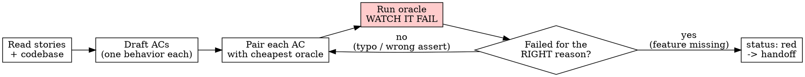

# Writing the Contract

## Overview

A `.episteme/contract.md` is the verifiable spec a feature's "done" is judged against - not the agent's word. Every acceptance criterion is **paired with a cheap oracle** (the exact test/command that proves it), and each oracle is authored **from the contract, blind to any implementation**, then run to confirm it **fails (RED)** before code exists.

**Core principle:** "Done" is proven against a contract, not declared by the implementer.

**Violating the letter of this rule is violating the spirit of this rule.**

This is the first step of the Episteme loop. It hands off to `synthesizing-the-policy`. Lineage: BMAD's `bmad-spec` already calls its spec a "Canonical contract" - the existence of a contract is not new. Our differentiator is that **each criterion carries a runnable oracle authored blind to the implementation**.

## The Iron Law

```
NO ACCEPTANCE CRITERION WITHOUT A CHEAP ORACLE THAT FAILS FIRST
```

An AC with no oracle is a wish. An oracle that has never been run RED is unproven - you don't know it tests the right thing.

Authored an oracle after looking at implementation code? It is contaminated. Delete it. Re-author it from the contract text alone, then watch it fail.

**No exceptions:**
- Don't write the oracle "around" code you already drafted
- Don't peek at the implementation "just to get the import path right"
- Don't mark an AC `green` you never saw go RED first
- Delete means delete

## The two agents that don't see each other

This is the whole point of the skill.

| Role | Reads | Writes | Must NOT see |
|------|-------|--------|--------------|
| **Oracle-author** (you, now) | the contract text, public interfaces, the existing codebase | the failing test/oracle per AC | the implementation that will satisfy it |
| **Implementer** (later, `implementing-a-story`) | the contract + the failing oracles | the code | the oracle's internals don't matter - they just make it pass |

You are wearing the oracle-author hat in this skill. Author the oracle from what the feature *must do*, never from how it *will be done*. If no implementation exists yet, this is automatic. If you are retrofitting a contract onto existing code, you must author the oracle from the contract statement and resist reading the code to shape the assertion.

Once authored and seen RED, oracle files are **immutable to the implementer**. The only legitimate way to change one is the amendment path below ("Amending the contract") - never a direct edit.

> The post-diff **critic** (`adversarial-critic`) is a *separate, later* check and is NOT this separation. The blind separation lives here: oracle-author vs implementer.

## When to Use

**Always, before:**
- Implementing a new feature or story
- Fixing a bug (the contract is the failing-symptom oracle)
- Synthesizing a policy/plan (`synthesizing-the-policy` reads the contract)

**Symptoms you skipped this:**
- "Done" only exists as prose in a ticket or your head
- An agent is coding against "make auth work" with no pass/fail line
- You can't name the command that would prove the feature complete

**When NOT to use:** throwaway spikes you will delete, or pure exploration where you don't yet know what "done" means (do that first, then write the contract).

## Pick the cheapest reliable oracle (right-oracle doctrine)

Prefer the cheapest deterministic gate that actually proves the criterion. Reach for an LLM/manual check only where no cheap oracle exists.

| Criterion is about... | Cheapest oracle |
|---|---|
| Behavior / business logic | a unit or integration **test** (`npm test -- file::case`, `pytest -k case`) |
| A type/shape contract | the **type-checker** (`tsc --noEmit`, `mypy`) |
| Style / forbidden pattern | **lint** / `grep` (`eslint`, `rg 'TODO' src/`) |
| It builds / compiles | the **build** (`npm run build`, exit 0) |
| An HTTP/CLI surface | a **command** asserting status/output (`curl -s ... | jq -e '.ok'`) |
| Migration equivalence ("output-equivalent to legacy on corpus <slice-id>") | the **corpus replay** (the manifest's `replay_command`; see "Migration contracts" below) |
| Subjective UX, copy, "feels right" | a documented **manual/LLM check** - mark `oracle: manual:` and say exactly what to look at |

Each oracle must be **specific** (names the exact test/case/command, not "the test suite") and **runnable as written**.

## The Process



1. **Read the source of truth.** The story/ask, the public interfaces it touches, and the existing codebase (so oracle commands are runnable - paths, test runner, scripts). This is the folded fact-gathering step; verified facts go to the ledger via `curating-the-ledger`.
2. **Draft acceptance criteria.** One observable behavior per AC. If a criterion says "and", split it. Write the human-readable statement first - what the user/system can do - before any test.
3. **Pair each AC with its cheapest oracle** (table above). Author the oracle **from the AC text, blind to implementation**. Name the exact case/command.
4. **Write the failing test/oracle** for each AC. It must reference a function/endpoint/type that does not exist yet (or, for a bug, reproduces the broken symptom).
5. **Run every oracle. Watch it fail.** This is mandatory and the heart of the skill.
6. **Confirm each failed for the RIGHT reason** - "feature missing" / "symptom reproduced", NOT a typo, bad import, or missing dependency. A wrong-reason failure means fix the oracle and re-run, not proceed.
7. **Fill the rest of the contract:** Interfaces/surface, Error taxonomy (each failure case ideally with its own oracle), Out of scope (this bounds the later critic).
8. **Set `status: red` on every AC** and `status: draft` in frontmatter. Hand off to `synthesizing-the-policy`.

### Watch it fail - the gate

**MANDATORY. Never skip.** For each oracle, run it and read the output:

```bash
$ npm test -- auth.spec.ts -t "rejects expired token"
FAIL  auth.spec.ts > rejects expired token
  ReferenceError: verifyToken is not defined
```

Confirm: it **fails** (not errors on setup), the failure is "feature missing" / symptom reproduced, and the message is what you expected. Passes already? Then it tests existing behavior, not this feature - the AC is wrong or already met. Errors on a typo? Fix the oracle, re-run, until it fails *correctly*.

<Good>
```markdown
- AC-2: An expired JWT is rejected with 401 and code `TOKEN_EXPIRED`.
  - oracle: `npm test -- auth.spec.ts -t "rejects expired token"`
  - status: red
```
Names the exact case; observable behavior; runnable; watched fail (ReferenceError: verifyToken not defined).
</Good>

<Bad>
```markdown
- AC-2: Auth should work well and be secure.
  - oracle: npm test
  - status: green
```
Unfalsifiable ("work well"); oracle is the whole suite, not a case; marked green having never gone red.
</Bad>

## What goes in `.episteme/contract.md`

Use `templates/contract.md`. Sections: frontmatter (`id`, `version`, `status`, `stories`); **Acceptance criteria** (each: id, statement, `oracle:`, `status: red|green`); **Interfaces / surface**; **Error taxonomy**; **Out of scope**. The Out of scope section is load-bearing: it is what the adversarial critic uses to reject scope drift later.

## Amending the contract (two-way renegotiation)

The gate is two-way. When implementation falsifies a criterion - it is wrong,
unreachable as written, or the design assumption underneath it was disproven by a
verdict/finding - do NOT grind against it and do NOT silently edit it. Amend:

1. Bump `version` in the frontmatter.
2. Change ONLY the affected criterion.
3. Re-author its oracle blind and **watch it fail (RED) again** - an amended
   criterion re-enters at the same gate as a new one.
4. Hand the change to `curating-the-ledger` for a `contract_version` entry citing
   what was falsified and by which verdict.

Amending one criterion is a small step, not a restart. A gate you cannot cheaply
renegotiate gets bypassed in practice - this path exists so the gate stays honest.

## Migration contracts (equivalence criteria)

In the Migration track the criteria read **"output-equivalent to legacy on corpus
<slice-id>"**, and the oracle is the **corpus replay**: recorded legacy inputs
replayed against the new code, compared to the captured legacy outputs. The capture
is made FROM the legacy system, blind to the new code - the blindness direction
flips (greenfield authors oracles blind to the implementation; migration captures
them blind to the NEW implementation). Authoring the contract ASSEMBLES the corpus:
compose the relevant `.episteme/captures/<CAP-id>/` entries into
`.episteme/corpus/<slice-id>/` and write its manifest (content-hashed; see
`templates/corpus-manifest.md`). From then on the corpus is read-only -
`verifying-equivalence` checks the hash every replay. Adjudicated `par-NNNN`
overrides from `.episteme/parity-map.md` are the ONLY legitimate expected-output
divergences from the capture.

## Common Mistakes

| Mistake | Fix |
|---|---|
| AC bundles many behaviors ("validates email and domain and length") | One behavior per AC. Split. |
| Oracle is `npm test` (the whole suite) | Name the exact file::case or command. |
| Oracle never run; AC born `green` | Run it. Watch RED. Only an oracle that failed proves it tests the feature. |
| Oracle authored after drafting the implementation | Contaminated. Re-author from contract text, blind. |
| Subjective AC with a "test" that can't decide it | Make it observable, or mark `oracle: manual:` with exactly what to inspect. |
| No "Out of scope" | Add it - it bounds the critic and stops scope drift. |
| Error cases only in prose | Give each failure case its own oracle in Error taxonomy. |

## Red Flags - STOP

- An AC with no `oracle:` line
- An AC marked `status: green` you never watched fail
- "I'll add the oracle once the code exists"
- Reading the implementation to decide what the test should assert
- An oracle that says "the test suite passes" instead of a specific case
- Phrases like "should work", "be robust", "handle errors gracefully" as an AC
- No "Out of scope" section
- Editing a criterion without bumping the version and re-failing its oracle - that is silent drift, not an amendment

**All of these mean: stop, author/run the oracle blind, and watch it go RED before continuing.**

## Rationalization Prevention

| Excuse | Reality |
|---|---|
| "The behavior is obvious, no oracle needed" | Obvious behavior still breaks and still drifts. The oracle is 2 minutes; the trust it buys is the whole point. |
| "I'll write the tests after I implement" | Tests written after pass immediately and prove nothing - you never saw them catch the gap. And they're shaped by your code, not the contract. |
| "Running it RED is ceremony, I know it'll fail" | Then it costs you nothing to confirm. If it *passes*, you just learned the AC was wrong - that's the catch you'd have shipped. |
| "I peeked at the code to get the import right" | The oracle is now biased toward what you built, not what's required. Re-author from the contract text. |
| "`npm test` is good enough as the oracle" | A whole-suite oracle can't tell you *this* criterion is met. Name the case. |
| "This AC is subjective, it can't have an oracle" | Then make it observable, or mark it `manual:` with the exact thing to inspect. "Subjective" is not "unverifiable". |
| "We have a deadline, skip the contract" | Without a contract, "done" is the agent's opinion and the critic has nothing to check. That's how the silent-bug ships. |
| "It's just a small bugfix" | The contract IS the failing-symptom test. Reproduce the bug as an oracle, watch it fail, then fix. |

## Verification Checklist

Before handing off to `synthesizing-the-policy`:

- [ ] Every AC is one observable behavior (no "and")
- [ ] Every AC has a specific, runnable `oracle:` (named case/command, not the whole suite)
- [ ] Each oracle authored from the contract, blind to implementation
- [ ] Ran every oracle and watched it fail (RED) - output read, not assumed
- [ ] Each failure was the RIGHT reason (feature missing / symptom reproduced)
- [ ] Every AC `status: red`; frontmatter `status: draft`
- [ ] Interfaces / surface listed
- [ ] Error taxonomy present, failure cases have oracles where cheap
- [ ] Out of scope present (bounds the critic)

Can't check all boxes? The contract is not ready. Don't hand off.

## The Bottom Line

A contract without oracles is a wish. An oracle never seen RED is unproven. Author each oracle blind to the implementation, watch it fail, mark it `red`, then hand off. That is the only "done" the rest of the loop will trust.
